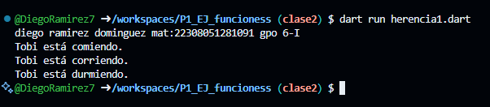

crear una clase animal con los atributos (id_animal, nombre y raza) y una función comer(). crear otra clase perro con herencia animal con las funciones correr() y otra dormir(). Lenguaje Dart

salida de resultados
