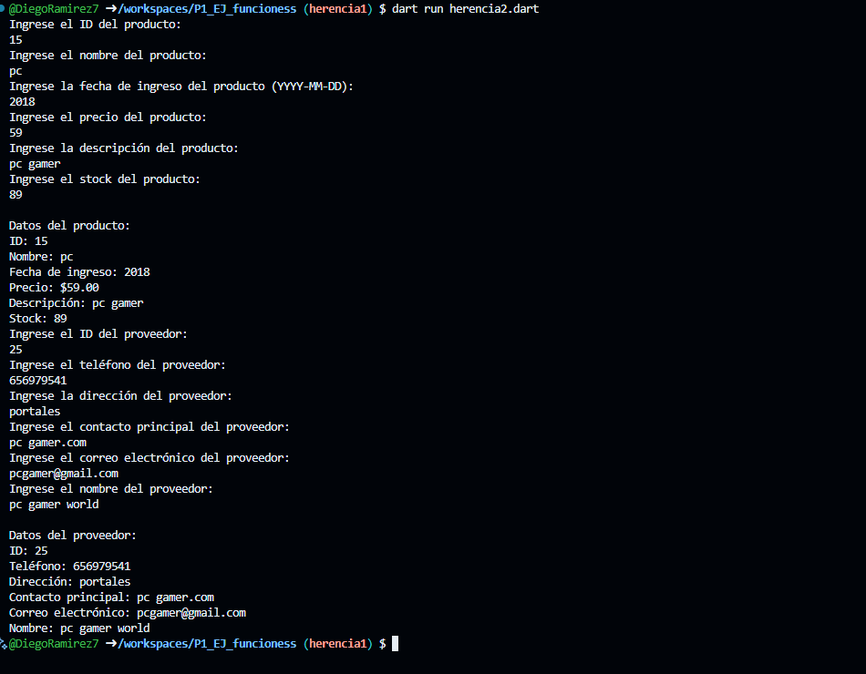

crear la clase productos con los atributos (id producto, nombre producto, fecha ingreso, precio producto, descripción producto, stock) con una función captura datos(), con interacción de interfaz de usuario. crear la clase DatosProductos con herencia Mascota y una función mostrarDatos(). lenguaje Dart

crear la clase proveedores con los atributos (id proveedores, telefono proveedor, direccion proveedor, contacto principal, correo electronico, nombre proveedor) con una función captura datos(), con interacción de interfaz de usuario. crear la clase DatosProveedores con herencia Mascota y una función mostrarDatos(). lenguaje Dart

